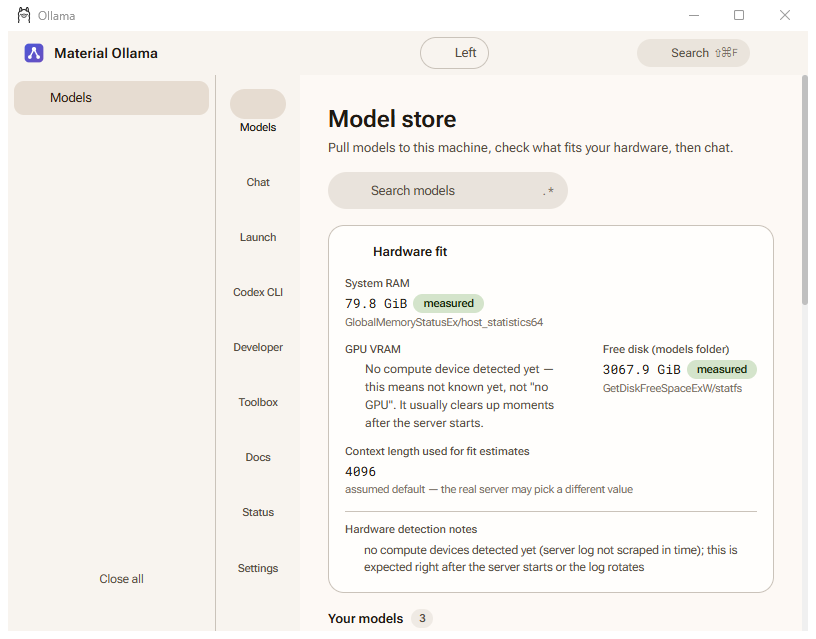
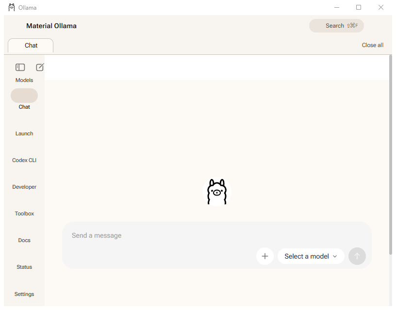
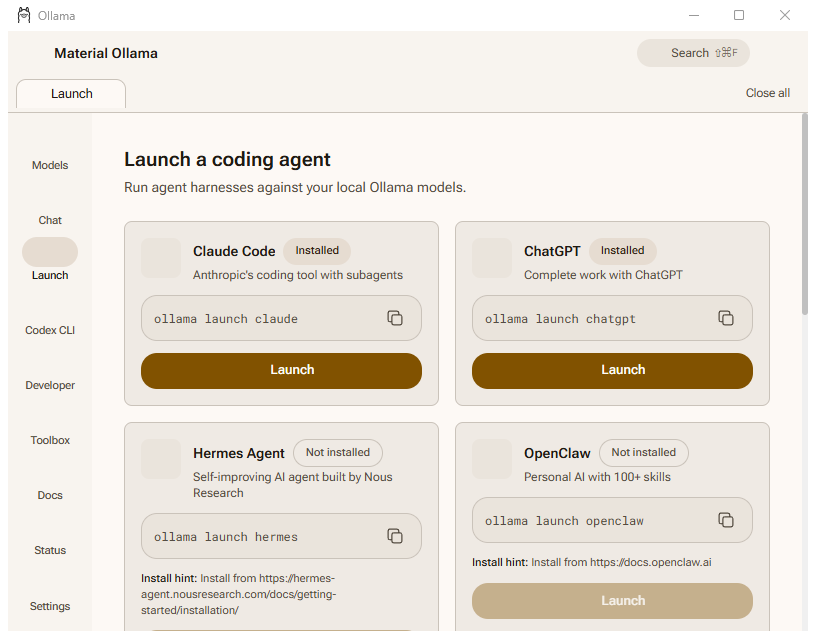
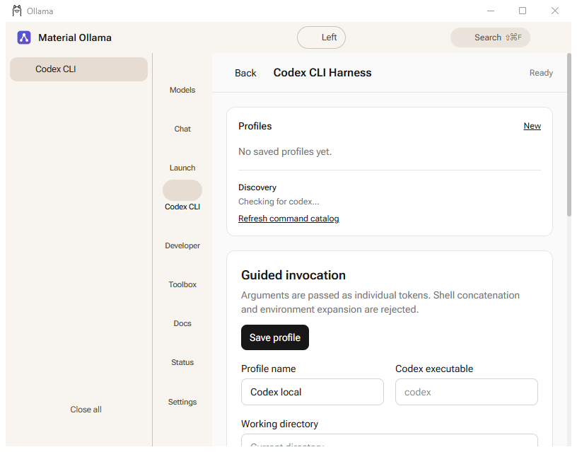
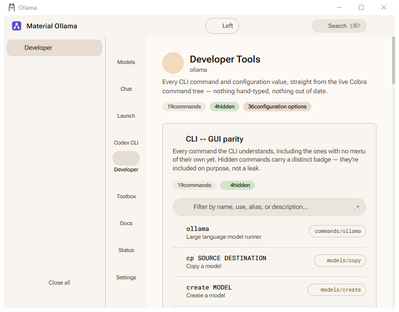
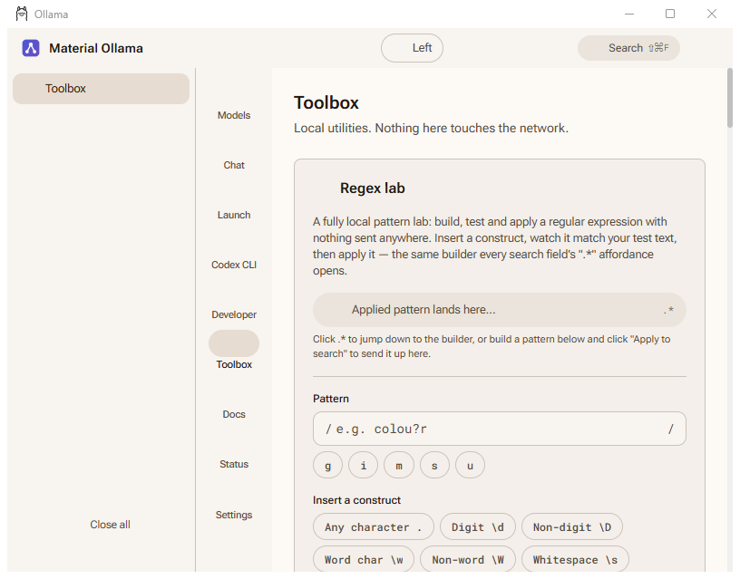
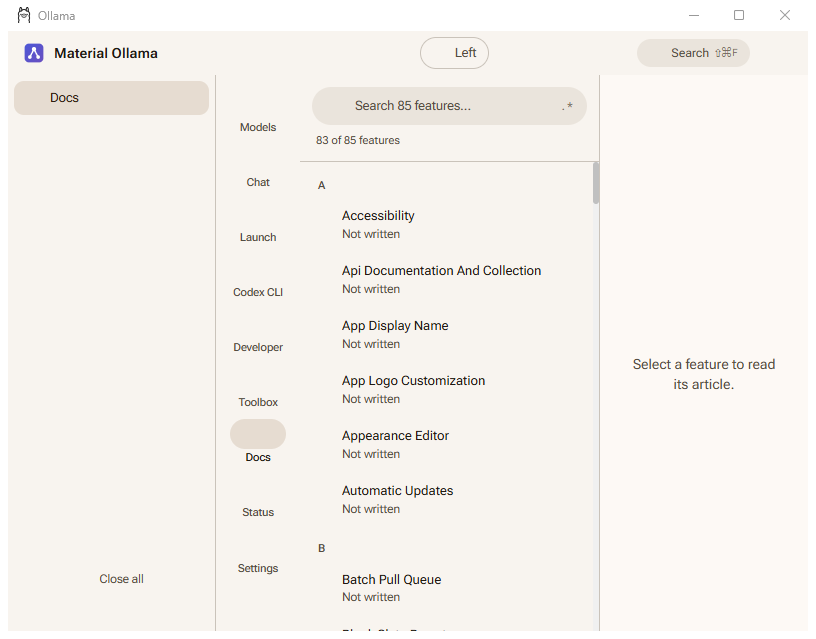
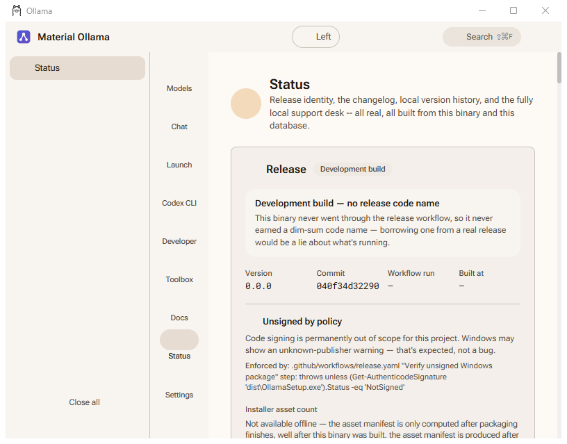
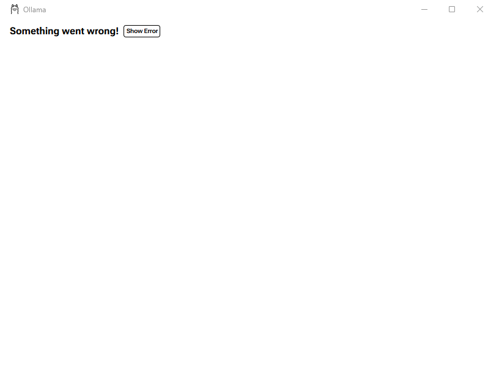

# Material Ollama

Material Ollama is a local-first desktop companion for Ollama. It keeps the upstream command-line and service behavior available while giving every supported operation a guided graphical route.

> **Surface boundary:** the landing and documentation site introduces the installed desktop application. It is not the runtime, does not host a model, and is not a playable substitute for the application.

## Start here

- Landing and documentation source: [`site/`](./site/)
- Existing static source and design notes: [`docs/landing-site/`](./docs/landing-site/)
- CLI and API documentation: [`docs/cli.mdx`](./docs/cli.mdx) and [`docs/api.md`](./docs/api.md)
- Feature contract inventory: [`docs/features/uh-completeness/`](./docs/features/uh-completeness/)
- Real built-artifact captures: [Real capture matrix](#real-capture-matrix) below, indexed in [`docs/features/uh-completeness/captures/`](./docs/features/uh-completeness/captures/)
- Installation: [Windows installer `v0.0.0-build.9`](https://github.com/Ding-Ding-Projects/material-ollama/releases/download/v0.0.0-build.9/OllamaSetup.exe) (40,211,120 bytes; SHA-256 `7571508dc67a4ea4b78f4c37aecea5f315ac8d6b564dca737144fd82b1cb41b0`). The installer is unsigned, so Windows may show an unknown-publisher or SmartScreen warning.
- Hosted landing URL: [Material Ollama Day Teet Hui](https://material-ollama-day-teet-hui.halowbak123.chatgpt.site) — the verified deployment is owner-only; anonymous visitors receive an access boundary rather than a misleading public success page.

## What this fork adds

Material Ollama preserves the upstream Ollama project and is rewriting its desktop GUI onto Material Design 3, alongside a documentation site. **This rewrite is in progress, not finished** — see [Feature and evidence status](#feature-and-evidence-status) and the [Real capture matrix](#real-capture-matrix) for exactly what exists today, what is still an explicit "not built yet" placeholder, and what has no real capture evidence at all. The target surface is:

- model discovery, installed and running-model state, hardware-fit evidence, pull queues, and local chat;
- command and configuration parity, including guided arguments, flags, aliases, profiles, provenance, restart, and rollback;
- a local file converter, exports, bulk actions, history, external-editor handoff, and offline documentation;
- accessible responsive navigation, browser-style tabs, groups, search, an anchored regex builder, a command palette, and recovery surfaces;
- local visitor settings on the landing page, with no analytics, CDN assets, or network dependency.

## Documentation map

| Area | Source | Purpose |
| --- | --- | --- |
| Landing surface | [`docs/landing-site/README.md`](./docs/landing-site/README.md) | Boundary, local settings, status, and verified-download rules |
| Hosted source | [`site/README.md`](./site/README.md) | Vinext/OpenNext-compatible build and hosting notes |
| CLI parity | [`docs/cli.mdx`](./docs/cli.mdx) | Upstream command behavior and integration routes |
| API parity | [`docs/api.md`](./docs/api.md) | Local API endpoints, streaming, and errors |
| Feature inventory | [`docs/features/uh-completeness/README.md`](./docs/features/uh-completeness/README.md) | Hand-written canonical coverage list and evidence fields |
| Capture harness | [`docs/features/uh-completeness/captures/README.md`](./docs/features/uh-completeness/captures/README.md) | How the real built-artifact screenshots below are produced and validated |
| Troubleshooting | [`docs/troubleshooting.mdx`](./docs/troubleshooting.mdx) | Recovery paths and known service issues |

Feature and evidence status

The feature inventory records every canonical user-facing contract independently for the desktop application and the landing page. A row is not considered complete merely because its name exists: implementation, documentation, localized copy, persistence, focused checks, built-artifact proof, and real capture evidence must be recorded separately.

The current landing-page source exposes a registry record for all 85 canonical IDs. The Windows release evidence is verified for `v0.0.0-build.9`.

The desktop application is a Material Design 3 rewrite of the upstream Ollama GUI, **in progress and not finished**. What exists and is reachable through the app's own navigation today: the frameless app shell and Material navigation rail, the MD3 primitive component set (Button through Badge), the MD3 token and runtime theme layer, the cross-cutting `@uh` layer (language modes, funny levels, School mode, narration, vocabulary), the settings store (`UIPreferences`, schema v17, OS credential vault), the model store backend (hardware snapshot, hardware-fit verdicts, a resumable pull queue), the CLI-to-GUI parity catalog generated from the live Cobra command tree, the local-only Toolbox regex builder, the Codex CLI and generic Launch harness screens, and the offline documentation browser. In-progress and not yet wired into a screen at all: the universal file converter, the built-in TOTP authenticator, and the local Ollama suite/Docker manager. Some navigation destinations that do exist — Status & records is the captured example below — are explicit "Not built yet" placeholder screens rather than finished ones, by design: the chrome and navigation entry are real, the content inside is not.

Real built-artifact captures now exist for the 9 screens the current build's navigation reaches; see the [Real capture matrix](#real-capture-matrix) below for exactly what those 9 captures show, their exact commit and provenance, and the coverage this does **not** yet include (dark theme, dialogs, most empty/error states, and any narrow or scaled layout).

Real capture matrix

Every image below is a genuine capture of the real built `dist/windows-ollama-app-amd64.exe` — never a mockup, a design file, a source preview, or an asserted result. Each was taken with the cheap-route `screenshot(hwnd)` call (Win32 `PrintWindow`) on a named off-screen Windows desktop, then independently validated as non-blank (distinct-colour count and per-channel standard deviation, via `scripts/capture/validate_capture.py`) before being recorded. Full per-image provenance — window class/title/dimensions, the exact resolved local URL, and the image's own SHA-256 — is in [`docs/features/uh-completeness/captures/manifest.json`](./docs/features/uh-completeness/captures/manifest.json); the harness that produced them, and why it needs `explorer.exe` running on the same headless desktop, is documented in [`docs/features/uh-completeness/captures/README.md`](./docs/features/uh-completeness/captures/README.md).

All 9 captures below share one build and one moment: artifact `dist/windows-ollama-app-amd64.exe` (55,028,224 bytes, SHA-256 `b6fd8c66f9982a229a241a126f7c81b704220adcce7ba8a26ca7d56a1e2c73d9`) at commit [`6a7dedaf`](https://github.com/Ding-Ding-Projects/material-ollama/commit/6a7dedafee9bfc6a1b8d2eec8823a5607a735615), captured between 2026-08-19T06:34:16Z and 2026-08-19T06:36:35Z. **That commit is 50 commits ahead of the released `v0.0.0-build.9` installer** — these screens show unreleased, in-progress work, not what today's public download installs.

| Screen | Capture | Route | Feature IDs shown |
| --- | --- | --- | --- |
| Models |  | `/models` | `model-store`, `hardware-fit`, `batch-pull-queue`, `regex-builder` |
| Chat (new) |  | `/c/new` | `local-chat-sessions` |
| Launch |  | `/launch` | `harness-profiles` |
| Codex CLI |  | `/codex` | `harness-profiles` |
| Developer |  | `/devtools` | (none recorded) |
| Toolbox |  | `/toolbox` | `regex-builder` |
| Docs |  | `/docs` | `offline-documentation-browser` |
| Status |  | `/status` | (none recorded) |
| Settings |  | `/settings` | `app-display-name` |

### What this does not cover

These 9 captures are the complete real-capture evidence that exists right now. Read them as exactly that wide and no wider — a missing, stale, mock, or unreachable capture blocks the release, and this list exists so the boundary is visible rather than implied:

- **No dark theme.** Every capture above is the light theme. No dark-theme capture exists yet for any screen.
- **No dialogs or overlays.** No destructive-action super-confirmation gate, toy-lock wizard, unlock ladder, appearance editor, infinite colour picker, command palette (`Ctrl+Shift+F`), or anchored popover/menu is captured anywhere in this matrix.
- **Only two states resembling "empty."** The Chat screen's blank composer and the Status screen's "Not built yet" placeholder are the only empty/unbuilt states shown. No captures exist for a no-search-results state, an empty notification centre, empty local version history, an empty Support Tickets list, or an error state (offline Ollama service, a failed model pull, invalid form input).
- **No narrow or scaled layout.** Every image above is the same fixed 816×639 desktop window. Nothing here shows a narrow width (down to 320px), a tablet width, or a non-100% display scale, all of which the accessibility contract requires.
- **Screens are captured once, at first paint.** The Settings capture, for example, shows only the top of that screen's scroll — the rest of its toggles are off-frame. The Docs capture shows the article list with nothing selected, never an open article. Scrolled, expanded, or mid-interaction states are not captured.
- **Whole surfaces are absent.** The universal file converter, the built-in TOTP authenticator, the local Ollama suite/Docker manager, app-logo customization, and the landing/documentation site itself have no built-artifact capture at all in this matrix.

Build and package

The desktop project follows the upstream Go/CMake toolchain. The hosted landing source has its own `package.json`, Vinext/Vite configuration, Cloudflare-compatible worker entry, and `.openai/hosting.json` metadata. Build dependencies must remain outside the desktop dependency tree.

The landing site uses the existing local mark and social-preview assets. It has no remote fonts, analytics, tracking scripts, or runtime model connection.

Release and download policy

Release notes identify the exact source commit, artifact names, hashes, line-count evidence, and unsigned status. The verified release is [v0.0.0-build.9](https://github.com/Ding-Ding-Projects/material-ollama/releases/tag/v0.0.0-build.9), targeting `8175c3ff1b490b7e17217b39f1b3b625f80dd218`; its Windows installer is [OllamaSetup.exe](https://github.com/Ding-Ding-Projects/material-ollama/releases/download/v0.0.0-build.9/OllamaSetup.exe), 40,211,120 bytes, SHA-256 `7571508dc67a4ea4b78f4c37aecea5f315ac8d6b564dca737144fd82b1cb41b0`. It is unsigned and may trigger an unknown-publisher or SmartScreen warning.

The release code name is **Scallop Har Gow · 帶子蝦餃** (dish ID `hk-dish-0002`). Its authoritative public image is [hk-dish-0002-scallop-har-gow.png](https://github.com/Ding-Ding-Projects/dim-sum-photos/releases/download/catalog-v1/hk-dish-0002-scallop-har-gow.png); this project links to the public catalog asset and does not copy or vendor the image. The landing URL is verified as deployed but remains owner-only.

## Upstream relationship

This project is based on [`ollama/ollama`](https://github.com/ollama/ollama). The local `upstream` remote is retained for non-destructive synchronization, while the fork's default branch is the integration target for Material Ollama work.

## License

See [`LICENSE`](./LICENSE) for the upstream license and attribution.
